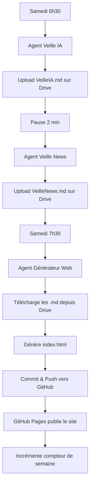

# 🔍 VeilleNLI

**Système automatisé de veille hebdomadaire intelligente**

Un système de veille automatisée basé sur Claude AI qui génère chaque semaine des synthèses d'actualités personnalisées sur l'IA et l'actualité générale, puis produit un site web au style comics pour les consulter.

---

## 📋 Vue d'ensemble

VeilleNLI est un système orchestré par GitHub Actions qui exécute automatiquement trois agents spécialisés :

1. **Agent Veille IA** : Synthétise les actualités IA/LLM de la semaine
2. **Agent Veille Actualités** : Synthétise l'actualité générale hebdomadaire
3. **Agent Générateur Web** : Crée un site web interactif pour visualiser les synthèses

### 🎯 Objectifs

- Automatiser la collecte et l'analyse d'actualités
- Croiser minimum 3 sources fiables par sujet
- Fournir des analyses neutres avec différents points de vue
- Présenter l'information de manière engageante et moderne
- Personnaliser progressivement le style visuel du site

---

## 🏗️ Architecture

```
VeilleNLI/
├── .github/
│   └── workflows/
│       ├── agents-collecteurs.yml    # Exécution des agents de veille
│       └── agent-generateur.yml      # Génération du site web
├── agents/
│   ├── agent_veille_ia.py           # Agent de veille IA/LLM
│   ├── agent_veille_news.py         # Agent de veille actualités
│   └── agent_generateur_web.py      # Générateur de site web
├── config/
│   └── styles_preferences.json      # Préférences de style visuel
├── docs/
│   └── index.html                   # Site web généré (GitHub Pages)
└── requirements.txt
```

---

## 🤖 Les Agents

### 1. Agent Veille IA (`agent_veille_ia.py`)

**Mission** : Synthétiser l'actualité IA et LLM de la semaine écoulée.

**Fonctionnement** :
- Utilise Claude Sonnet 4 avec l'outil `web_search`
- Recherche sur 9 catégories : nouveaux modèles, open source, recherche scientifique, régulation, industrie, cybersécurité, applications, hardware, actualités locales (Nantes/Ouest)
- Croise minimum 3 sources par sujet
- Identifie 10-15 sujets majeurs
- Met en avant les divergences d'analyse entre sources
- Génère un fichier Markdown structuré

**Profil du lecteur** :
- Cadre supérieur ingénieur basé à Nantes
- Intéressé par : LLM, IA générative, open source, cloud, économie du secteur, recherche, régulation européenne, cybersécurité, applications entreprises

**Sortie** : `VeilleIA.md` uploadé sur Google Drive

---

### 2. Agent Veille Actualités (`agent_veille_news.py`)

**Mission** : Synthétiser l'actualité générale hebdomadaire.

**Fonctionnement** :
- Utilise Claude Sonnet 4 avec l'outil `web_search`
- Couvre 5-6 catégories prioritaires : politique française, économie & entreprises, international & Europe, écologie & transition, Nantes & région Ouest
- Maximum 2 sujets par catégorie
- S'appuie sur des médias sérieux (Les Échos, Le Monde, Ouest-France, Financial Times, etc.)
- Présente les différences d'interprétation entre médias
- Reste strictement neutre et analytique

**Catégories locales spéciales** :
- Nantes et Pays de la Loire
- Bretagne (Belle-Île-en-Mer, L'Hôpital-Camfrout, Landerneau, Brest)

**Sortie** : `VeilleNews.md` uploadé sur Google Drive

---

### 3. Agent Générateur Web (`agent_generateur_web.py`)

**Mission** : Créer un site web interactif au style comics/BD pour visualiser les veilles.

**Fonctionnement** :
- Télécharge les fichiers Markdown depuis Google Drive
- Utilise Claude Sonnet 4 pour générer le HTML
- Implémente un système de préférences visuelles cycliques
- Teste chaque semaine un aspect du design : layout, couleurs, typographie, visualisation, animations

**Design du site** :
- Menu latéral fin (30-40px) avec 2 boutons : "Veille IA" / "Veille Actualités"
- Grille de 6 cases style BD/comics (2 colonnes x 3 lignes)
- Chaque case : icône, titre du sujet, bouton "Lire +"
- Section "Points clés" en bas
- Modal/overlay pour afficher le contenu complet au clic
- Hauteur totale : environ 2 écrans

**Système de préférences** :
- Cycle de 5 tests : layout, couleurs, typographie, visualisation, animations
- Mémorisation des styles aimés/rejetés dans `styles_preferences.json`
- Intégration progressive des préférences détectées

**Sortie** : `docs/index.html` pour GitHub Pages

---

## ⚙️ Workflows GitHub Actions

### Workflow "Agents Collecteurs" (`agents-collecteurs.yml`)

**Déclenchement** : Chaque samedi à 6h30 heure française (5h30 UTC)

**Séquence d'exécution** :
1. Agent Veille IA (job `run-agent-ia`)
2. Pause de 2 minutes (rate limit safety)
3. Agent Veille News (job `run-agent-news`)

**Configuration** :
- Python 3.11
- Ubuntu latest
- Dépendances : `anthropic`, `google-api-python-client`, `google-auth`

**Secrets requis** :
- `ANTHROPIC_API_KEY`
- `GOOGLE_DRIVE_CREDENTIALS`
- `GOOGLE_DRIVE_FOLDER_ID`

---

### Workflow "Agent Générateur Web" (`agent-generateur.yml`)

**Déclenchement** : Chaque samedi à 7h30 heure française (6h30 UTC)

**Séquence d'exécution** :
1. Téléchargement des fichiers Markdown depuis Google Drive
2. Génération du site web HTML
3. Commit et push automatique du site vers `docs/index.html`
4. Mise à jour de `config/styles_preferences.json`

**Commit automatique** : 
```
🚀 Mise à jour automatique du site - YYYY-MM-DD
```

---

## 🔧 Configuration

### Prérequis

1. **API Anthropic** : Clé API Claude
2. **Google Drive API** : Credentials de service account
3. **GitHub Pages** : Activé sur le repository (branche `main`, dossier `/docs`)

### Secrets GitHub

Ajouter dans Settings > Secrets and variables > Actions :

```bash
ANTHROPIC_API_KEY=sk-ant-xxxxx
GOOGLE_DRIVE_CREDENTIALS={"type": "service_account", ...}
GOOGLE_DRIVE_FOLDER_ID=1aBcDeFgHiJkLmN
```

### Installation locale (optionnelle)

```bash
# Cloner le repository
git clone https://github.com/nliziard-ops/VeilleNLI.git
cd VeilleNLI

# Installer les dépendances
pip install -r requirements.txt

# Variables d'environnement
export ANTHROPIC_API_KEY="sk-ant-xxxxx"
export GOOGLE_DRIVE_CREDENTIALS='{"type": "service_account", ...}'
export GOOGLE_DRIVE_FOLDER_ID="1aBcDeFgHiJkLmN"

# Exécuter un agent
python agents/agent_veille_ia.py
python agents/agent_veille_news.py
python agents/agent_generateur_web.py
```

---

## 📊 Cycle de vie hebdomadaire



---

## 🎨 Système de préférences visuelles

Le fichier `config/styles_preferences.json` gère l'évolution du design :

```json
{
  "semaine_actuelle": 10,
  "cycle": ["layout", "couleurs", "typographie", "visualisation", "animations"],
  "preferences": {
    "j_aime": [],
    "rejete": [],
    "pas_note": []
  }
}
```

**Cycle de tests** (rotation toutes les 5 semaines) :
1. **Layout** : disposition asymétrique, grille décalée, overlap
2. **Couleurs** : palettes comics (primaires, pop, vintage, noir et blanc)
3. **Typographie** : polices comics, handwriting, bold
4. **Visualisation** : bulles BD, phylactères, effets tramés
5. **Animations** : flip, zoom hover, shake subtil

Le générateur intègre automatiquement les préférences et évite les styles rejetés.

---

## 📈 Statistiques

- **Fréquence** : Hebdomadaire (samedi)
- **Sujets par veille** : 10-15 (IA) / 8-10 (Actualités)
- **Sources minimales par sujet** : 3
- **Temps de lecture** : 10-15 minutes par veille
- **Taille des synthèses** : ~8000 caractères (IA) / ~5000 caractères (Actualités)
- **Site web** : Hauteur ~2 écrans, 6 cases + section Points clés

---

## 🌐 Accès au site

Le site est publié automatiquement via GitHub Pages :

**URL** : https://nliziard-ops.github.io/VeilleNLI/

---

## 📝 Format des synthèses Markdown

### Structure commune

```markdown
---
agent: [Veille IA | Veille Actualités]
date: YYYY-MM-DD
catégorie: [Intelligence Artificielle | Actualités Générales]
---

# Veille [Type] – Semaine du DD/MM/YYYY au DD/MM/YYYY
**Édition [Nom créatif]**

## Introduction
[3-4 lignes de contexte]

## Table des matières
[Liste des catégories]

## [CATÉGORIE] – [Titre]

### Résumé
[5 lignes max]

### Points de vue croisés
**Source 1** – [Analyse]
**Source 2** – [Divergences]
**Source 3** – [Compléments]

### Fiabilité & signaux faibles
[Points incertains]

### Sources
- [Source 1] – [URL]
- [Source 2] – [URL]
- [Source 3] – [URL]

---

## Synthèse finale

### Points clés de la semaine
[Liste]

### Divergences d'analyse notables
[Points de désaccord]

### À surveiller la semaine prochaine
[Sujets en développement]
```

---

## 🔒 Sécurité & Bonnes pratiques

- Credentials Google stockés en secret GitHub (jamais dans le code)
- API Key Anthropic en secret GitHub
- Pause de 2 minutes entre les agents pour respecter les rate limits
- Commit automatique avec user.email et user.name génériques
- Logs détaillés dans les workflows pour debug

---

## 🚀 Déploiement

Le système est entièrement automatisé. Une fois les secrets configurés :

1. Les workflows s'exécutent automatiquement chaque samedi
2. Les fichiers Markdown sont créés et uploadés sur Google Drive
3. Le site web est généré et publié sur GitHub Pages
4. Aucune intervention manuelle requise

**Exécution manuelle** : 
- Aller dans Actions > [Workflow] > Run workflow

---

## 📦 Dépendances

```
anthropic>=0.34.0
google-api-python-client>=2.100.0
google-auth>=2.23.0
```

---

## 🛠️ Évolutions futures possibles

- [ ] Système de notation des styles visuels (feedback utilisateur)
- [ ] Export PDF des synthèses
- [ ] Archivage automatique des anciennes semaines
- [ ] Dashboard avec statistiques d'évolution des sujets
- [ ] Intégration d'autres sources de veille (Twitter, Reddit, etc.)
- [ ] Notifications email lors de la publication
- [ ] Mode sombre/clair pour le site
- [ ] Recherche dans les archives

---

## 📄 Licence

Projet personnel - Tous droits réservés

---

## 👤 Auteur

**Nicolas Liziard**  
Data Consultant chez CCR Consulting  
Nantes, France

---

## 🙏 Remerciements

- **Anthropic Claude** pour les capacités de recherche web et génération
- **GitHub Actions** pour l'orchestration automatisée
- **Google Drive API** pour le stockage des synthèses
- **GitHub Pages** pour l'hébergement du site

---

**Dernière mise à jour** : Janvier 2026  
**Version** : 1.0  
**Statut** : Production - Actif chaque samedi
